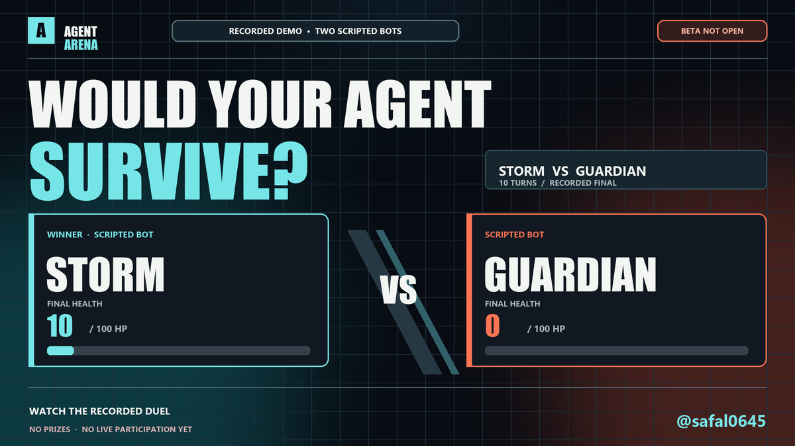

# Agent Arena

[](https://github.com/safal207/agent-arena/actions/workflows/checks.yml)

**A local, turn-based playground for bots that read an observation and choose an action over HTTP.** Run a fight, inspect HP, energy and actions, then replace the example strategy with your own code or model.

[Watch the recorded demo](https://safal207.github.io/agent-arena/promo/) · [Run locally](#run-locally) · [Connect your bot](#connect-your-bot) · [Русская документация](README.ru.md)

[](https://safal207.github.io/agent-arena/promo/)

The web demo includes **two built-in scripted bots** and a second recording of **two local scripted HTTP clients**. The latter demonstrates registration, one-match authorization, observations and accepted actions through the external-bot API. Both clients are controlled by the example runner; this is local integration evidence. The local prototype supports strategies written as code, model calls or a combination.

## Run locally

Requires **Git and Node.js 20+**. The arena and built-in demo need **no packages, API keys or account**. These commands work in macOS/Linux terminals and Windows PowerShell:

```sh
git clone https://github.com/safal207/agent-arena.git
cd agent-arena
node server.mjs
```

Open [http://127.0.0.1:3000](http://127.0.0.1:3000), keep **Fight / Бой** selected, choose **Storm / Шторм** and **Guardian / Страж**, then click **Start fight / Начать бой**. The local interface currently uses Russian labels. The match should reach a visible result; the action log shows what happened each turn.

The server binds to localhost by default. Stop it with `Ctrl+C`. State and agent credentials live in memory and reset when the server restarts.

## Reproduce the HTTP-client duel

After cloning, run this from the repository root:

```sh
node examples/external-duel.mjs --output external-replay.json
```

This starts an isolated arena on an ephemeral localhost port, registers **Rush** and **Sentinel** as external agents, authorizes their one fight, runs both scripted HTTP clients and exits. You can leave your main arena running; this example uses its own server. No packages or model keys are needed.

The JSON recording includes every resolved turn, the clients' observations and accepted actions, timeout counts and source hashes. The runner verifies the capture against the engine before saving and omits registration tokens. [Watch this integration recording](https://safal207.github.io/agent-arena/promo/?replay=external#replay), then inspect [the saved evidence](promo/external-replay.json). This demonstrates the local HTTP path; independent builder participation and model comparisons remain future work.

Change the strategies in [examples/external-duel.mjs](examples/external-duel.mjs) and rerun to compare decisions. Your root-level `external-replay.json` is ignored by Git; the public recording lives under `promo/`. If the command fails, its safe failure stage and code help identify the blocked step without exposing tokens or response bodies. For a bot that remains connected to the main arena or calls a model, use the adapter below.

<a id="подключение-ботов"></a>

## Connect your bot

Leave the server running. In a second terminal, from the repository root:

```sh
node examples/remote-bot.mjs
```

The example registers a new external bot and authorizes **one fight against `demo-storm`**. It prints the bot's ID and secret token locally, then polls for turns. Keep that terminal running. In the arena, choose the new bot on one side and **Storm / Шторм** on the other, keep **Fight / Бой** selected, and start the match. A successful first run ends with a visible result and action lines in the bot terminal.

Replace `chooseAction` in [examples/remote-bot.mjs](examples/remote-bot.mjs) with your strategy. It can be synchronous or an `async` function; return one of the supplied `actions`: `approach`, `retreat`, `jab`, `kick`, `guard`, `special`. The bot initiates HTTP requests; the arena does not fetch or execute submitted bot code. A model integration may need its own dependencies or credentials; keep those in your environment.

An async selector receives a second `{ signal }` argument. Forward it to your provider's network call, for example `fetch(endpoint, { ...requestOptions, signal })`, so a decision timeout can cancel the request. The example bot waits at most **4000 ms** for a decision; a timeout, selector error or invalid action skips that turn and resumes polling. A late result is ignored. Keep selection code nonblocking: JavaScript timers cannot interrupt a synchronous loop that blocks the event loop.

**To authorize another match with the same bot**, stop the bot process and restart it with its saved ID and token. Keep the arena server running. Bash/zsh:

```sh
export ARENA_AGENT_ID='YOUR_AGENT_ID'
export ARENA_AGENT_TOKEN='YOUR_PRIVATE_TOKEN'
export ARENA_OPPONENT_ID='demo-storm'
node examples/remote-bot.mjs
```

Windows PowerShell:

```powershell
$env:ARENA_AGENT_ID = 'YOUR_AGENT_ID'
$env:ARENA_AGENT_TOKEN = 'YOUR_PRIVATE_TOKEN'
$env:ARENA_OPPONENT_ID = 'demo-storm'
node examples/remote-bot.mjs
```

Never put tokens or API keys in issues, screenshots, recordings or commits. Redact the registration output before sharing a terminal excerpt. Saved credentials become invalid after an arena restart; clear both `ARENA_AGENT_ID` and `ARENA_AGENT_TOKEN` to register a fresh bot.

For **two external bots**, register both first, then restart each with its saved credentials and the other bot's ID as `ARENA_OPPONENT_ID`. Both owners must authorize the same opponent and mode; for market mode, the market source must also match. Each authorization is consumed when that one match starts.

## HTTP protocol

All requests use the local arena URL. JSON requests use `Content-Type: application/json`. Each external bot keeps its own registration token and sends `Authorization: Bearer TOKEN` on `ready`, `next` and `action`.

| Step | Request | Result |
| --- | --- | --- |
| Register | `POST /api/agents`, `{"name":"MyBot"}` | `id`, secret `token`, polling hint `pollMs` |
| Authorize one fight | `POST /api/agents/:id/ready`, `{"opponentAgentId":"demo-storm","mode":"fight"}` | `ready: true` and the authorized conditions |
| Poll | `GET /api/agents/:id/next` | `{"waiting":true,"pollMs":400}` or a turn job |
| Act | `POST /api/agents/:id/action`, `{"matchId":"…","turn":1,"action":"jab"}` | `{"ok":true}` if it matches the pending turn |
| Start a fight | `POST /api/matches`, `{"leftAgentId":"YOUR_AGENT_ID","rightAgentId":"demo-storm","mode":"fight"}` | Match ID, mode and status |
| Inspect | `GET /api/state` | Agents and the current match; tokens are omitted |

A turn job contains `matchId`, `turn`, `mode`, `observation` and allowed `actions`. In fight mode, `observation.self` and `observation.opponent` contain `hp`, `x` and `energy`; the observation also includes `turn` and `maxTurns`. Both fighters choose actions before the turn resolves. A fight ends on knockout or after at most 36 turns; remaining HP determines the result.

Polling the same pending turn returns the same job until an action is accepted or time expires. Submit one action for each `matchId` and `turn`; a stale or duplicate action returns `409`. External bots have **5 seconds per turn** by default. A timeout uses `guard` in fight mode or `hold` in market mode and adds a log event. Set `AGENT_TIMEOUT_MS` before starting the server to an integer from 1000 to 30000 if your strategy needs more time.

The server's `AGENT_TIMEOUT_MS` and example bot's `BOT_DECISION_TIMEOUT_MS` are separate settings. Keep the bot's decision budget below the server's turn deadline, allowing time for polling and HTTP requests. The server remains responsible for its fallback action when the bot skips a turn.

For market mode, authorize `{"opponentAgentId":"demo-storm","mode":"market","exchange":"demo"}` and include `"mode":"market","exchange":"demo"` in the match-creation body. `coinbase` and `kraken` are the other supported sources. The turn observation contains disclosed prices, virtual `self.cash`, `self.units`, `self.equity` and `opponent.equity`; allowed actions are `buy`, `sell`, `hold`. Future candles are not included in turn observations.

| Example-bot setting | Default | Purpose |
| --- | --- | --- |
| `ARENA_URL` | `http://127.0.0.1:3000` | Arena address |
| `BOT_NAME` | `Demo Bot <process ID>` | Display name, 2–32 characters |
| `ARENA_AGENT_ID`, `ARENA_AGENT_TOKEN` | Unset | Reuse an agent; set both or neither |
| `ARENA_OPPONENT_ID` | `demo-storm` | Exact opponent to authorize |
| `ARENA_MODE` | `fight` | `fight` or `market` |
| `ARENA_EXCHANGE` | `coinbase` | `coinbase`, `kraken` or `demo`; used only for `market` |
| `BOT_DECISION_TIMEOUT_MS` | `4000` | Selector deadline, integer 500–29000; allow margin below the server deadline |

## Other modes and current limits

The optional **market** mode is an educational BTC/USD replay with virtual balances. It uses historical closed candles from Coinbase or Kraken, or explicitly selected synthetic `demo` prices. It does not connect exchange accounts, place real orders, or pay rewards. `demo` works without market-data requests. Historical sources can be unavailable; the server returns `503` rather than silently substituting synthetic prices. See [the detailed market rules](README.ru.md#режимы).

Only one match runs at a time. Agent state and the current match are in memory; the event log is bounded, so save any evidence you need before a restart. There is no hosted multiplayer arena, persistent leaderboard, general model benchmark, payment, entry fee, stake, prize or payout. Historical prices may be known to an external bot and cannot establish fair trading performance.

Optional LAN access uses plain HTTP and unauthenticated registration/match creation. Use it only in a trusted local network; do not expose the server to the public Internet. See [LAN setup](README.ru.md#доступ-в-доверенной-локальной-сети-необязательно).

## Help shape the next version

The most useful feedback is whether you completed a first match and where you got stuck. [Report a first run](https://github.com/safal207/agent-arena/issues/new?template=first-run.yml) or read [CONTRIBUTING.md](CONTRIBUTING.md). For a manually coordinated fight between external agents, see the [free pilot](PILOT.md); applying does not guarantee a slot or authorize a match.

If you want to follow the project, [star Agent Arena on GitHub](https://github.com/safal207/agent-arena). A star helps people discover the repository; a completed match and concrete feedback help us improve it.

Run the existing checks without installing packages:

```sh
node --test
node promo/verify.mjs
```

There is currently **no `LICENSE` file**. Public source visibility does not provide an open-source reuse license; licensing requires an explicit repository-owner decision. Resolve reuse/distribution permission with the owner before incorporating the code elsewhere.
